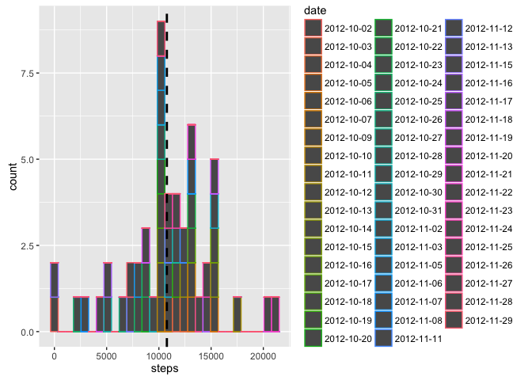
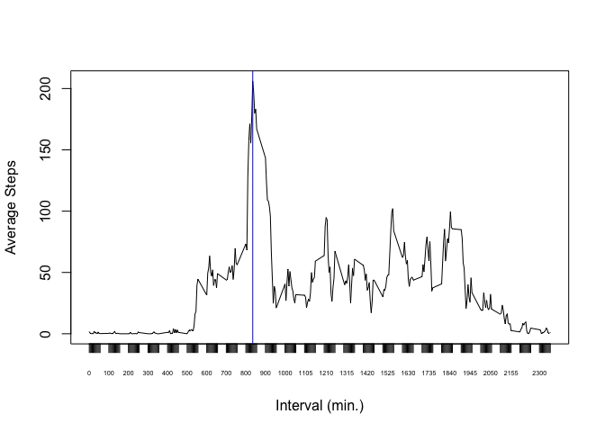
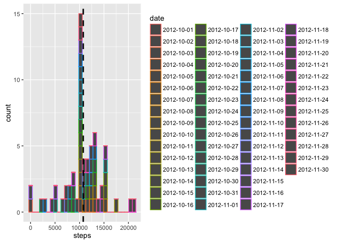
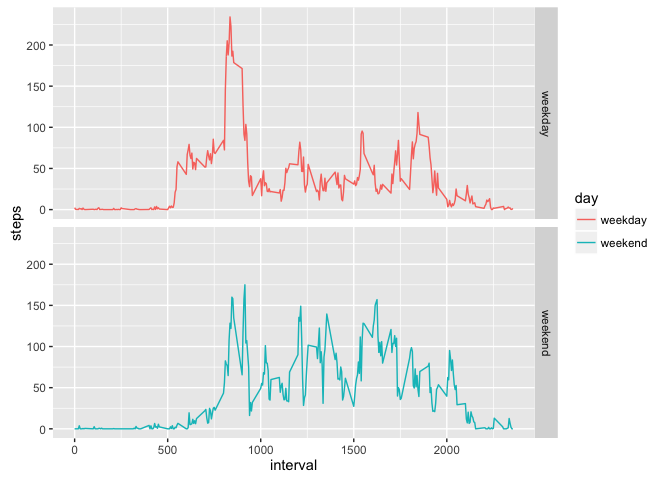

# Reproducible Research: Peer Assessment 1


```
## 
## Attaching package: 'dplyr'
```

```
## The following objects are masked from 'package:stats':
## 
##     filter, lag
```

```
## The following objects are masked from 'package:base':
## 
##     intersect, setdiff, setequal, union
```

```
## Warning: package 'ggplot2' was built under R version 3.2.4
```

```
## Warning: package 'lubridate' was built under R version 3.2.4
```

```
## 
## Attaching package: 'lubridate'
```

```
## The following object is masked from 'package:base':
## 
##     date
```

## Set the working directory

```
## [1] "/Users/rociosegura/coursera/ReproducibleResearch/RepData_PeerAssessment1"
```

## Loading and preprocessing the data

```r
activitydata <- read.table("./activity.csv", sep=",", header=TRUE)

activity_complete <- activitydata[complete.cases(activitydata),]

head(activity_complete)
```

```
##     steps       date interval
## 289     0 2012-10-02        0
## 290     0 2012-10-02        5
## 291     0 2012-10-02       10
## 292     0 2012-10-02       15
## 293     0 2012-10-02       20
## 294     0 2012-10-02       25
```
## What is mean total number of steps taken per day?

```r
totStepsPerDay <- activity_complete %>% group_by(date) %>% 
summarise(steps=sum(steps, na.rm=TRUE)) 

steps_mean <- summarise(totStepsPerDay, steps_avg = mean(steps))

ggplot(data = totStepsPerDay, aes(x = steps, color = date)) +
geom_histogram(stat = "bin") + 
    geom_vline(data=steps_mean, aes(xintercept=steps_avg),
               linetype="dashed", size=1)
```

```
## `stat_bin()` using `bins = 30`. Pick better value with `binwidth`.
```



```r
summary(totStepsPerDay)
```

```
##          date        steps      
##  2012-10-02: 1   Min.   :   41  
##  2012-10-03: 1   1st Qu.: 8841  
##  2012-10-04: 1   Median :10765  
##  2012-10-05: 1   Mean   :10766  
##  2012-10-06: 1   3rd Qu.:13294  
##  2012-10-07: 1   Max.   :21194  
##  (Other)   :47
```
## What is the average daily activity pattern?
###1. Make a time series plot (i.e. `type = "l"`) of the 5-minute interval (x-axis) and the average number of steps taken, averaged across all days (y-axis)

```r
StepsPerIntervalAvg <- activity_complete %>% group_by(interval) %>% 
summarise(steps_avg=mean(steps, na.rm=TRUE)) 

max_steps <- StepsPerIntervalAvg %>% 
  filter(steps_avg == max(steps_avg)) %>%
  arrange(interval)

plot(StepsPerIntervalAvg$interval, StepsPerIntervalAvg$steps_avg, xlab = "Interval (min.)", ylab = "Average Steps", xaxt = "n", type = "l")
axis(1, StepsPerIntervalAvg$interval, cex.axis = .45)
abline(v=max_steps$interval, col="blue")
```



###2. Which 5-minute interval, on average across all the days in the dataset, contains the maximum number of steps?

```r
max_steps
```

```
## Source: local data frame [1 x 2]
## 
##   interval steps_avg
##      (int)     (dbl)
## 1      835  206.1698
```
## Imputing missing values
###Note that there are a number of days/intervals where there are missing values (coded as `NA`). The presence of missing days may introduce bias into some calculations or summaries of the data.

###1. Calculate and report the total number of missing values in the dataset (i.e. the total number of rows with `NA`s)

```r
sum(is.na(activitydata$steps))
```

```
## [1] 2304
```
###2. Devise a strategy for filling in all of the missing values in the dataset. The strategy does not need to be sophisticated. For example, you could use the mean/median for that day, or the mean for that 5-minute interval, etc.

```r
activitydata_wk <- activitydata %>% mutate(weekdy = weekdays(as_date(date)))
narows<-subset(activitydata_wk, is.na(activitydata_wk$steps)) 

#get average steps grouped by interval for weekdays
weekdays <- c("Monday", "Tuesday", "Wednesday", "Thursday", "Friday")
AvgStepsWkdy <- activitydata_wk %>% filter(weekdy  %in% weekdays) %>% group_by(interval) %>% 
summarise(steps=mean(steps,na.rm=TRUE)) 

#get average steps grouped by interval for weekends
weekend <- c("Saturday", "Sunday")
AvgStepsWkend <- activitydata_wk %>% filter(weekdy %in% weekend) %>% group_by(interval) %>% 
summarise(steps=mean(steps,na.rm=TRUE)) 

#creating a new data frame by doing a cartesian product merge of distinct weekday dates that have NA and imputed weekday data frame
na_distinct_dates_wkdy <- narows %>% filter(weekdy %in% weekdays) %>% select(date) %>% distinct(date) 
imputed_wkdy <- merge(na_distinct_dates_wkdy, AvgStepsWkdy, by= NULL)

#creating a new data frame by doing a cartesian product merge of distinct weekend dates that have NA and imputed weekend data frame
na_distinct_dates_wkend <- narows %>% filter(weekdy  %in% weekend) %>% select(date) %>% distinct(date)
imputed_wkend <- merge(na_distinct_dates_wkend, AvgStepsWkend, by= NULL)
```
###3. Create a new dataset that is equal to the original dataset but with the missing data filled in.

```r
activity_imputed <- rbind(activity_complete, imputed_wkdy, imputed_wkend)
activity_imputed <- activity_imputed %>% arrange(date, interval)
```
###4. Make a histogram of the total number of steps taken each day and Calculate and report the **mean** and **median** total number of steps taken per day. Do these values differ from the estimates from the first part of the assignment? What is the impact of imputing missing data on the estimates of the total daily number of steps?

```r
totStepsPerDay_imp <- activity_imputed %>% group_by(date) %>% 
summarise(steps=sum(steps, na.rm=TRUE)) 

steps_mean_imp <- summarise(totStepsPerDay_imp, steps_avg = mean(steps))

ggplot(data = totStepsPerDay_imp, aes(x = steps, color = date)) +
geom_histogram(stat = "bin") + 
    geom_vline(data=steps_mean_imp, aes(xintercept=steps_avg),
               linetype="dashed", size=1)
```

```
## `stat_bin()` using `bins = 30`. Pick better value with `binwidth`.
```



```r
summary(totStepsPerDay_imp)
```

```
##          date        steps      
##  2012-10-01: 1   Min.   :   41  
##  2012-10-02: 1   1st Qu.: 9819  
##  2012-10-03: 1   Median :10571  
##  2012-10-04: 1   Mean   :10762  
##  2012-10-05: 1   3rd Qu.:12811  
##  2012-10-06: 1   Max.   :21194  
##  (Other)   :55
```

## Are there differences in activity patterns between weekdays and weekends?
### For this part the `weekdays()` function may be of some help here. Use the dataset with the filled-in missing values for this part.

```r
activity_imputed <- activity_imputed %>% mutate(weekdy = weekdays(as_date(date)))
```
### 1. Create a new factor variable in the dataset with two levels -- "weekday" and "weekend" indicating whether a given date is a weekday or weekend day.

```r
weekend <- c("Saturday", "Sunday")
activity_imputed <- activity_imputed %>% mutate(day = as.factor(ifelse(weekdy %in% weekend,"weekend", "weekday")))
```
### 1. Make a panel plot containing a time series plot (i.e. `type = "l"`) of the 5-minute interval (x-axis) and the average number of steps taken, averaged across all weekday days or weekend days (y-axis). The plot should look something like the following, which was created using **simulated data**:

```r
StepsPerIntervalAvg_imp <- activity_imputed %>% group_by(interval,day) %>% 
summarise(steps=mean(steps, na.rm=TRUE)) 

ggplot(StepsPerIntervalAvg_imp) + facet_grid(day ~ .)  + geom_line(aes(x = interval, y = steps, color = day))
```


